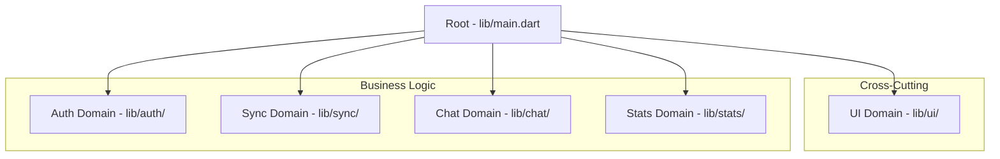

# ARCHITECTURE_MAP.md - HeartSync

## Overview
HeartSync utilizes a **Domain-Driven Modular Architecture**. The system is split into independent domains, each responsible for a specific business capability.

## Core Pillars
1. **Separation of Concerns**: UI, Business Logic, and Data layers are strictly separated within each domain.
2. **Domain Isolation**: Domains communicate through defined interfaces, preventing spaghetti dependencies.
3. **Reactive State**: The app follows a reactive pattern to ensure real-time "sync" between partners.

## Module Tree

## Layer Definitions
- **Presentation**: Flutter Widgets & State Management.
- **Domain/Business**: Business logic, models, and use cases.
- **Infrastructure/Data**: Repository implementations, API clients, and local storage.

## Communication Pattern
- Domains should not import each other directly unless it's a shared utility.
- Use a "Mediator" or "Service Locator" for cross-domain communication if needed.
